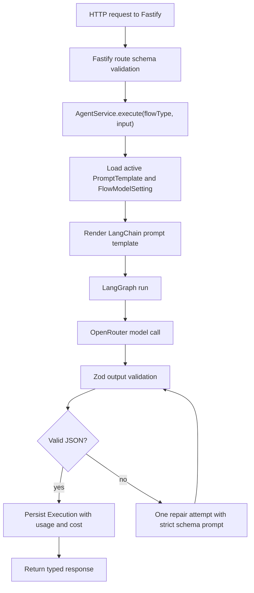

# CPJ-Cobranca AI Agent Implementation Plan

> **For agentic workers:** REQUIRED SUB-SKILL: Use superpowers:subagent-driven-development (recommended) or superpowers:executing-plans to implement this plan task-by-task. Steps use checkbox (`- [ ]`) syntax for tracking.

**Goal:** Build a containerized full-stack project for the CPJ-Cobranca case with a Node.js/Fastify backend, a Next.js admin frontend, editable database-backed prompts, OpenRouter multi-model execution, execution history, and usage/cost visibility.

**Architecture:** The backend remains a dedicated Node.js service with Fastify under `apps/api`, exposing all required case endpoints on port `3000`. The admin frontend is a separate Next.js App Router application under `apps/web`, running on port `3001` and consuming the backend admin API. Shared TypeScript contracts live in `packages/shared`, while Prisma, LangChain, LangGraph, OpenRouter, prompt versioning, execution persistence, and cost tracking stay in the backend.

**Tech Stack:** Node.js 22, TypeScript, Fastify, Next.js App Router, React, Zod, Prisma, SQLite, LangChain JS, LangGraph JS, OpenRouter, Vitest, Supertest, Playwright, Docker Compose.

---

## Source References

- Case file: `C:\trabalho\case\Case_Tecnico_Dev_Pleno_CPJ_Cobranca_IA.docx`
- Fastify validation and serialization: https://fastify.dev/docs/latest/Reference/Validation-and-Serialization/
- Next.js Route Handlers and App Router docs for the admin frontend: https://nextjs.org/docs/app/getting-started/route-handlers
- Next.js standalone Docker output: https://nextjs.org/docs/app/getting-started/deploying
- Docker guide for Next.js containers: https://docs.docker.com/guides/nextjs/containerize/
- LangGraph JS overview: https://docs.langchain.com/oss/javascript/langgraph/overview
- LangChain structured output: https://docs.langchain.com/oss/javascript/langchain/structured-output
- LangChain OpenRouter integration: https://docs.langchain.com/oss/javascript/integrations/chat/openrouter
- OpenRouter API reference: https://openrouter.ai/docs/api/reference/overview
- OpenRouter chat completion endpoint: https://openrouter.ai/docs/api/api-reference/chat/send-chat-completion-request
- OpenRouter models metadata: https://openrouter.ai/docs/guides/overview/models

## Product Scope

The evaluator-facing delivery is the backend API requested by the case. The Next.js admin frontend is a differential: it shows prompt governance, model configuration, usage/cost visibility, and auditability.

Required backend endpoints on `http://localhost:3000`:

- `POST /api/v1/review`
- `POST /api/v1/compliance`
- `POST /api/v1/document`
- `POST /api/v1/tests`
- `GET /health`
- `GET /api/v1/history`
- `GET /api/v1/history/:id`

Admin frontend:

- URL: `http://localhost:3001/admin`
- Framework: Next.js App Router
- Consumes backend admin endpoints through `NEXT_PUBLIC_API_BASE_URL`

Additional admin capabilities:

- edit prompt templates by flow
- create immutable prompt template versions
- activate one prompt version per flow
- choose primary model, fallback models, temperature, and max tokens per flow
- sync available OpenRouter models and pricing metadata
- inspect execution history with tokens, model, cost, latency, status, and errors
- view usage dashboard grouped by day, flow, model, and status

## Branch and Commit Strategy

Repository:

- GitHub owner: `Cledson96`
- Repository name: `cpj-cobranca-ai-agent`
- Visibility: public
- Stable branch: `main`
- Working branch: `development`

Workflow:

- `main` starts with the planning/bootstrap commit.
- `development` receives all implementation commits.
- Each implementation slice gets a short commit.
- Commit messages stay in Portuguese and use the user's preferred prefixes.

Commit message examples:

```text
docs: atualizar plano do projeto
feature: iniciar monorepo
feature: criar api fastify
feature: criar schema do prisma
feature: adicionar templates de prompt
feature: integrar openrouter
feature: criar endpoints do case
feature: criar painel next
bug: corrigir validacao de resposta
docs: atualizar exemplos do readme
chore: configurar docker
test: cobrir historico de execucoes
```

## Key Design Decisions

### Backend Framework

Use Fastify for the backend API. The case is contract-heavy, with strict JSON inputs and outputs. Fastify gives good request validation, predictable route structure, strong TypeScript ergonomics, and a focused backend surface.

### Frontend Framework

Use Next.js only for the admin frontend. It should not replace the backend service. The Next app provides dashboards, prompt editing, model settings, and execution audit screens while the required API remains in Fastify.

### Monorepo Layout

Use npm workspaces:

- `apps/api`: Fastify backend
- `apps/web`: Next.js admin frontend
- `packages/shared`: shared Zod schemas, TypeScript types, constants, and API response contracts

This keeps backend and frontend independent enough for clarity, but avoids copy-pasting contracts.

### LLM Provider

Use OpenRouter as the primary provider because it exposes many models behind one OpenAI-compatible API. Store the requested model, model actually used, token counts, generation id, and cost returned by OpenRouter for each execution.

### LangChain and LangGraph

Use LangGraph inside the Fastify backend for small, auditable execution graphs. Every public flow uses the same graph shape:

1. load active flow settings and prompt template from the database
2. render system and user prompts with LangChain prompt templates
3. call OpenRouter with primary and fallback models
4. parse and validate structured JSON with Zod
5. repair once if the model returned invalid JSON
6. persist execution and usage telemetry
7. return the typed case response

### Prompt Templates

Prompt templates live in the database. The backend seeds safe initial versions, then the Next admin UI can create new versions. Existing executions store `promptTemplateId` and `promptTemplateVersion`, so results remain auditable after templates evolve.

### Cost Tracking

Store cost telemetry per LLM call. First persist `usage` from OpenRouter's chat completion response. When a generation id is available and `OPENROUTER_FETCH_GENERATION_STATS=true`, call the generation stats endpoint after the request to enrich cost data. The dashboard displays missing cost as `nao informado` rather than hiding it.

### Database

Use SQLite via Prisma for the case. It is allowed by the brief, keeps Docker simple, and makes the evaluator's setup lighter. The README will explain that PostgreSQL would be the production choice for concurrent multi-user operation.

## Data Model

### `Execution`

Stores every required agent execution.

- `id`: string UUID
- `createdAt`: DateTime
- `flowType`: enum `review | compliance | document | tests | batch`
- `status`: enum `success | failed`
- `inputPayload`: Json
- `outputPayload`: Json nullable
- `errorMessage`: string nullable
- `durationMs`: int
- `requestHash`: string
- `promptTemplateId`: string nullable
- `promptTemplateVersion`: int nullable
- `modelRequested`: string
- `modelUsed`: string nullable
- `provider`: string default `openrouter`
- `generationId`: string nullable
- `promptTokens`: int nullable
- `completionTokens`: int nullable
- `totalTokens`: int nullable
- `reasoningTokens`: int nullable
- `cachedTokens`: int nullable
- `costUsd`: decimal nullable

### `PromptTemplate`

Stores editable, versioned prompt templates.

- `id`: string UUID
- `flowType`: enum `review | compliance | document | tests`
- `name`: string
- `version`: int
- `isActive`: boolean
- `systemTemplate`: string
- `userTemplate`: string
- `responseSchemaName`: string
- `notes`: string nullable
- `createdAt`: DateTime
- `updatedAt`: DateTime

Unique constraints:

- `(flowType, version)`
- one active template per flow enforced in service logic inside a transaction

### `FlowModelSetting`

Stores model and generation parameters per flow.

- `id`: string UUID
- `flowType`: enum `review | compliance | document | tests`
- `primaryModel`: string
- `fallbackModels`: Json array of model ids
- `temperature`: decimal
- `maxTokens`: int
- `responseFormatMode`: enum `json_schema | json_object`
- `updatedAt`: DateTime

### `OpenRouterModel`

Stores model catalog metadata for selection and cost estimates.

- `id`: string OpenRouter model id, for example `openai/gpt-4o-mini`
- `name`: string
- `contextLength`: int nullable
- `promptPrice`: decimal nullable
- `completionPrice`: decimal nullable
- `requestPrice`: decimal nullable
- `supportedParameters`: Json
- `rawMetadata`: Json
- `syncedAt`: DateTime

### `UsageDailyAggregate`

Optional cached aggregate for fast dashboard reads. It can be rebuilt from `Execution`.

- `id`: string UUID
- `day`: DateTime
- `flowType`: enum nullable
- `modelUsed`: string nullable
- `requestCount`: int
- `successCount`: int
- `failedCount`: int
- `promptTokens`: int
- `completionTokens`: int
- `totalTokens`: int
- `costUsd`: decimal
- `updatedAt`: DateTime

## Public Backend API Contract

### `GET /health`

Returns:

```json
{
  "status": "ok",
  "service": "cpj-cobranca-ai-agent",
  "timestamp": "2026-05-23T12:00:00.000Z"
}
```

### `POST /api/v1/review`

Input:

```json
{
  "code": "export async function calcularOferta(...) { ... }",
  "language": "typescript",
  "context": "Modulo CarteiraNegociacao.ts"
}
```

Output follows the case schema exactly:

```json
{
  "overall_quality": "needs_improvement",
  "score": 5,
  "issues": [
    {
      "severity": "high",
      "line_hint": "query SELECT",
      "description": "Interpolacao direta de devedorId em SQL.",
      "suggestion": "Use query parametrizada para evitar SQL injection."
    }
  ],
  "positives": ["Funcao pequena e objetivo de negocio claro."],
  "summary": "O codigo resolve parte do fluxo, mas precisa de ajustes de seguranca e robustez."
}
```

### `POST /api/v1/compliance`

Input:

```json
{
  "task_description": "Historia: Registrar tentativa de contato...",
  "code": "app.post('/contatos', async (req, res) => { ... })",
  "language": "javascript"
}
```

Output follows the case schema exactly.

### `POST /api/v1/document`

Input:

```json
{
  "code": "def classify_aging(...): ...",
  "language": "python",
  "doc_type": "technical"
}
```

Output follows the case schema exactly.

### `POST /api/v1/tests`

Input:

```json
{
  "code": "export function calcularJurosSimples(...) { ... }",
  "language": "typescript",
  "test_framework": "jest"
}
```

Output follows the case schema exactly.

### `GET /api/v1/history`

Returns the latest 20 executions:

```json
[
  {
    "id": "7d2d5c9b-2a2b-4ad9-8f98-9712b9a93a40",
    "type": "review",
    "status": "success",
    "timestamp": "2026-05-23T12:00:00.000Z",
    "duration_ms": 1840,
    "model_used": "openai/gpt-4o-mini",
    "cost_usd": 0.00014
  }
]
```

### `GET /api/v1/history/:id`

Returns the stored input, output, metadata, prompt version, usage, and error fields for one execution.

## Backend Admin API Contract

All admin endpoints require:

```http
x-admin-token: <ADMIN_TOKEN>
```

### `GET /api/admin/prompt-templates`

Returns all prompt templates grouped by flow and sorted by version.

### `POST /api/admin/prompt-templates`

Creates a new prompt template version.

```json
{
  "flowType": "review",
  "name": "Review Padrao v2",
  "systemTemplate": "Voce e um revisor tecnico...",
  "userTemplate": "Linguagem: {{language}}\nContexto: {{context}}\nCodigo:\n{{code}}",
  "responseSchemaName": "review",
  "notes": "Versao com foco reforcado em seguranca."
}
```

### `POST /api/admin/prompt-templates/:id/activate`

Marks the selected version as active for its flow and deactivates the previous active version in the same transaction.

### `GET /api/admin/flow-settings`

Returns model settings per flow.

### `PUT /api/admin/flow-settings/:flowType`

Updates the model and generation parameters for a flow.

```json
{
  "primaryModel": "openai/gpt-4o-mini",
  "fallbackModels": ["google/gemini-2.5-flash", "anthropic/claude-3.5-haiku"],
  "temperature": 0.1,
  "maxTokens": 1800,
  "responseFormatMode": "json_schema"
}
```

### `POST /api/admin/models/sync`

Fetches OpenRouter model metadata and pricing from the models endpoint and stores it locally.

### `GET /api/admin/models`

Returns locally synced OpenRouter models with pricing and supported parameters.

### `GET /api/admin/usage/summary?from=2026-05-23&to=2026-05-26`

Returns dashboard metrics:

```json
{
  "request_count": 42,
  "success_count": 40,
  "failed_count": 2,
  "total_tokens": 180200,
  "cost_usd": 0.87,
  "by_flow": [
    { "flow_type": "review", "request_count": 20, "cost_usd": 0.32 }
  ],
  "by_model": [
    { "model_used": "openai/gpt-4o-mini", "request_count": 42, "cost_usd": 0.87 }
  ]
}
```

## Next.js Admin UI Screens

### Dashboard

Purpose: see whether the system is working and how much it costs.

Components:

- total requests
- success/failure count
- total tokens
- total cost in USD
- average latency
- table by flow
- table by model
- latest 10 executions

### Prompt Templates

Purpose: edit prompt behavior without redeploying.

Components:

- flow tabs: review, compliance, document, tests
- active version badge
- version list
- system template editor
- user template editor
- response schema display
- create version button
- activate version button
- test prompt button that runs a real request against the backend

### Models

Purpose: choose OpenRouter models and understand cost trade-offs.

Components:

- sync models button
- model search
- model table with provider id, context length, input price, output price, supported parameters
- per-flow model settings form
- fallback order editor

### Executions

Purpose: audit the agent.

Components:

- filters by flow, status, model, date
- execution list
- detail drawer with input, output, prompt version, raw usage, cost, and error message

## Request Execution Flow



## Suggested File Structure

```text
.
├── README.md
├── Dockerfile.api
├── Dockerfile.web
├── docker-compose.yml
├── .dockerignore
├── .env.example
├── .gitignore
├── package.json
├── package-lock.json
├── tsconfig.base.json
├── requests
│   └── cpj-cobranca-agent.http
├── apps
│   ├── api
│   │   ├── package.json
│   │   ├── tsconfig.json
│   │   ├── vitest.config.ts
│   │   ├── prisma
│   │   │   ├── schema.prisma
│   │   │   └── seed.ts
│   │   └── src
│   │       ├── server.ts
│   │       ├── app.ts
│   │       ├── config/env.ts
│   │       ├── plugins/prisma.ts
│   │       ├── plugins/admin-auth.ts
│   │       ├── routes/health.routes.ts
│   │       ├── routes/agent.routes.ts
│   │       ├── routes/history.routes.ts
│   │       ├── routes/admin.routes.ts
│   │       ├── modules/agent/agent.service.ts
│   │       ├── modules/agent/agent.graph.ts
│   │       ├── modules/agent/output-parser.ts
│   │       ├── modules/executions/execution.repository.ts
│   │       ├── modules/llm/openrouter.client.ts
│   │       ├── modules/llm/model-catalog.service.ts
│   │       ├── modules/llm/usage.service.ts
│   │       └── modules/prompts/prompt-template.service.ts
│   └── web
│       ├── package.json
│       ├── next.config.ts
│       ├── tsconfig.json
│       ├── app
│       │   ├── layout.tsx
│       │   ├── page.tsx
│       │   ├── globals.css
│       │   └── admin
│       │       ├── page.tsx
│       │       ├── prompts/page.tsx
│       │       ├── models/page.tsx
│       │       └── executions/page.tsx
│       └── src
│           ├── api-client.ts
│           └── components
│               ├── Nav.tsx
│               ├── StatCard.tsx
│               └── JsonViewer.tsx
├── packages
│   └── shared
│       ├── package.json
│       ├── tsconfig.json
│       └── src
│           ├── flow-types.ts
│           ├── case-schemas.ts
│           └── admin-schemas.ts
└── tests
    └── e2e
        └── admin.spec.ts
```

## Environment Variables

Backend `.env` values:

```env
NODE_ENV=development
PORT=3000
DATABASE_URL=file:./dev.db

OPENROUTER_API_KEY=
OPENROUTER_DEFAULT_MODEL=openai/gpt-4o-mini
OPENROUTER_SITE_URL=http://localhost:3001
OPENROUTER_APP_TITLE=CPJ Cobranca AI Agent
OPENROUTER_FETCH_GENERATION_STATS=true

ADMIN_TOKEN=change-me-local-admin-token
LOG_LEVEL=info
```

Frontend `.env` values:

```env
NEXT_PUBLIC_API_BASE_URL=http://localhost:3000
NEXT_PUBLIC_ADMIN_APP_NAME=CPJ Cobranca AI Agent
```

## Implementation Tasks

### Task 1: GitHub Repository and Local Branches

**Files:**

- Create: `.gitignore`
- Modify: `docs/superpowers/plans/2026-05-23-cpj-cobranca-ai-agent.md`

- [ ] Initialize Git in `C:\trabalho\case`.
- [ ] Create local branch `main`.
- [ ] Add `.gitignore` excluding `.env`, `node_modules`, `.next`, Prisma SQLite files, logs, coverage, and `*.docx`.
- [ ] Commit the planning document and `.gitignore` with `docs: atualizar plano do projeto`.
- [ ] Create public GitHub repository `Cledson96/cpj-cobranca-ai-agent`.
- [ ] Push `main`.
- [ ] Create branch `development` from `main`.
- [ ] Push `development`.
- [ ] Set local branch to `development` for implementation work.

### Task 2: Monorepo Foundation

**Files:**

- Create: `package.json`
- Create: `tsconfig.base.json`
- Create: `packages/shared/package.json`
- Create: `packages/shared/tsconfig.json`
- Create: `packages/shared/src/flow-types.ts`
- Create: `packages/shared/src/case-schemas.ts`
- Create: `packages/shared/src/admin-schemas.ts`

- [ ] Create npm workspaces for `apps/api`, `apps/web`, and `packages/shared`.
- [ ] Configure shared TypeScript settings.
- [ ] Define shared flow types and Zod schemas.
- [ ] Commit: `feature: iniciar monorepo`

### Task 3: Fastify Backend Foundation

**Files:**

- Create: `apps/api/package.json`
- Create: `apps/api/tsconfig.json`
- Create: `apps/api/vitest.config.ts`
- Create: `apps/api/src/app.ts`
- Create: `apps/api/src/server.ts`
- Create: `apps/api/src/config/env.ts`
- Create: `apps/api/src/routes/health.routes.ts`
- Create: `apps/api/tests/health.test.ts`

- [ ] Create the Fastify app factory.
- [ ] Create typed environment loader with Zod.
- [ ] Add `GET /health`.
- [ ] Add health endpoint test.
- [ ] Commit: `feature: criar api fastify`

### Task 4: Prisma Schema and Seed Data

**Files:**

- Create: `apps/api/prisma/schema.prisma`
- Create: `apps/api/prisma/seed.ts`
- Create: `apps/api/src/plugins/prisma.ts`
- Create: `apps/api/src/modules/prompts/seed-templates.ts`

- [ ] Define `Execution`, `PromptTemplate`, `FlowModelSetting`, `OpenRouterModel`, and `UsageDailyAggregate`.
- [ ] Seed one active prompt template per required flow.
- [ ] Seed one flow model setting per required flow using `OPENROUTER_DEFAULT_MODEL`.
- [ ] Add Prisma plugin to Fastify.
- [ ] Run migration locally.
- [ ] Commit: `feature: criar schema do prisma`

### Task 5: OpenRouter Client and Model Catalog

**Files:**

- Create: `apps/api/src/modules/llm/openrouter.client.ts`
- Create: `apps/api/src/modules/llm/model-catalog.service.ts`
- Create: `apps/api/src/modules/llm/usage.service.ts`
- Create: `apps/api/tests/openrouter.client.test.ts`

- [ ] Implement OpenRouter chat completion call using `https://openrouter.ai/api/v1/chat/completions`.
- [ ] Send `Authorization`, `HTTP-Referer`, `X-OpenRouter-Title`, and `Content-Type` headers.
- [ ] Support primary model plus fallback `models` array.
- [ ] Request `response_format` as JSON Schema when configured.
- [ ] Capture `id`, `model`, `usage.prompt_tokens`, `usage.completion_tokens`, `usage.total_tokens`, `usage.cost`, cached tokens, and reasoning tokens.
- [ ] Implement optional generation stats enrichment when `OPENROUTER_FETCH_GENERATION_STATS=true`.
- [ ] Implement model sync from OpenRouter model catalog.
- [ ] Unit test client with mocked fetch.
- [ ] Commit: `feature: integrar openrouter`

### Task 6: Prompt Template Service

**Files:**

- Create: `apps/api/src/modules/prompts/prompt-template.service.ts`
- Create: `apps/api/tests/prompt-template.service.test.ts`

- [ ] Load active prompt template for a flow.
- [ ] Render `systemTemplate` and `userTemplate` using input variables.
- [ ] Create a new template version without mutating older versions.
- [ ] Activate one template version per flow inside a transaction.
- [ ] Reject activation when `responseSchemaName` does not match the flow.
- [ ] Commit: `feature: adicionar templates de prompt`

### Task 7: Agent Graph and Output Parser

**Files:**

- Create: `apps/api/src/modules/agent/agent.graph.ts`
- Create: `apps/api/src/modules/agent/output-parser.ts`
- Create: `apps/api/src/modules/agent/agent.service.ts`
- Create: `apps/api/tests/output-parser.test.ts`

- [ ] Build a small LangGraph state graph with nodes for prompt loading, LLM call, output validation, repair, and persistence.
- [ ] Validate model output against the correct Zod schema for the flow.
- [ ] Run one repair attempt when parsing fails.
- [ ] Return a clear error after repair fails.
- [ ] Persist failed executions with `status=failed`.
- [ ] Commit: `feature: criar executor langgraph`

### Task 8: Public Backend Routes

**Files:**

- Create: `apps/api/src/routes/agent.routes.ts`
- Create: `apps/api/src/routes/history.routes.ts`
- Create: `apps/api/tests/agent.routes.test.ts`

- [ ] Implement `POST /api/v1/review`.
- [ ] Implement `POST /api/v1/compliance`.
- [ ] Implement `POST /api/v1/document`.
- [ ] Implement `POST /api/v1/tests`.
- [ ] Implement `GET /api/v1/history`.
- [ ] Implement `GET /api/v1/history/:id`.
- [ ] Mock `AgentService` in route tests to verify contracts without spending OpenRouter credits.
- [ ] Commit: `feature: criar endpoints do case`

### Task 9: Backend Admin Routes

**Files:**

- Create: `apps/api/src/plugins/admin-auth.ts`
- Create: `apps/api/src/routes/admin.routes.ts`
- Create: `apps/api/src/modules/admin/admin.service.ts`
- Create: `apps/api/tests/admin.routes.test.ts`

- [ ] Add `x-admin-token` authentication for `/api/admin/*`.
- [ ] Implement prompt template list/create/activate routes.
- [ ] Implement model sync/list routes.
- [ ] Implement flow settings read/update routes.
- [ ] Implement usage summary route.
- [ ] Implement execution audit data for the admin UI.
- [ ] Commit: `feature: criar api administrativa`

### Task 10: Next.js Admin Frontend

**Files:**

- Create: `apps/web/package.json`
- Create: `apps/web/next.config.ts`
- Create: `apps/web/tsconfig.json`
- Create: `apps/web/app/layout.tsx`
- Create: `apps/web/app/page.tsx`
- Create: `apps/web/app/globals.css`
- Create: `apps/web/app/admin/page.tsx`
- Create: `apps/web/app/admin/prompts/page.tsx`
- Create: `apps/web/app/admin/models/page.tsx`
- Create: `apps/web/app/admin/executions/page.tsx`
- Create: `apps/web/src/api-client.ts`
- Create: `apps/web/src/components/Nav.tsx`
- Create: `apps/web/src/components/StatCard.tsx`
- Create: `apps/web/src/components/JsonViewer.tsx`
- Create: `tests/e2e/admin.spec.ts`

- [ ] Build admin shell with four areas: Dashboard, Prompts, Models, Executions.
- [ ] Add token input screen when `ADMIN_TOKEN` is missing from local storage.
- [ ] Build prompt template editor with version list and activation.
- [ ] Build model settings page with synced model list and per-flow settings.
- [ ] Build usage dashboard with aggregate cards and tables.
- [ ] Build executions table with detail drawer.
- [ ] Verify `/admin` in Playwright.
- [ ] Commit: `feature: criar painel next`

### Task 11: Docker and Runtime

**Files:**

- Create: `Dockerfile.api`
- Create: `Dockerfile.web`
- Create: `docker-compose.yml`
- Create: `.dockerignore`
- Create: `.env.example`
- Modify: `package.json`

- [ ] Add root scripts for `dev`, `build`, `start`, `lint`, `test`, `test:e2e`, `prisma:migrate`, and `prisma:seed`.
- [ ] Add Dockerfile for the Fastify backend.
- [ ] Add Dockerfile for the Next.js frontend using standalone output.
- [ ] Add Docker Compose services `api` and `web`.
- [ ] Use a named volume for SQLite database persistence.
- [ ] Ensure `docker compose up --build` starts backend on `3000` and frontend on `3001`.
- [ ] Verify `curl http://localhost:3000/health` returns 200.
- [ ] Commit: `chore: configurar docker`

### Task 12: Request Examples and README

**Files:**

- Create: `requests/cpj-cobranca-agent.http`
- Create: `README.md`

- [ ] Add one runnable `.http` example for each required flow.
- [ ] Add history and health examples.
- [ ] Document technical decisions: Fastify backend, Next.js admin frontend, SQLite, Prisma, LangGraph, LangChain, OpenRouter.
- [ ] Document how to configure OpenRouter.
- [ ] Document prompt template editing and admin token.
- [ ] Document usage/cost dashboard.
- [ ] Document branch strategy with `main` and `development`.
- [ ] Document commit convention in Portuguese.
- [ ] Document trade-offs and what would change with more time.
- [ ] Commit: `docs: atualizar exemplos do readme`

### Task 13: Final Verification

**Files:**

- Modify only files needed to fix issues found during verification.

- [ ] Run `npm test`.
- [ ] Run `npm run lint`.
- [ ] Run `npm run build`.
- [ ] Run `docker compose up --build`.
- [ ] Run the four `.http` examples against the backend service.
- [ ] Open `http://localhost:3001/admin` and verify prompts, models, usage, and execution detail pages render.
- [ ] Check that history contains the latest executions with model and cost data.
- [ ] Commit fixes using `bug:` for defects or `test:` for test-only changes.

## Testing Strategy

Use mocked OpenRouter responses for automated tests. Real OpenRouter calls happen only during manual verification and `.http` examples after setting `OPENROUTER_API_KEY`.

Coverage targets:

- Fastify route validation
- exact output shape per case endpoint
- prompt template versioning and activation
- model setting updates
- OpenRouter response normalization
- usage and cost persistence
- history and usage summary queries
- admin token protection
- Next.js admin UI smoke flow

## README Story

The README should make the evaluator comfortable in the first two minutes:

1. this is a backend API case with a Next.js admin UI as an operational differential
2. Docker starts backend and frontend with one command
3. the required backend runs on `http://localhost:3000`
4. the admin UI runs on `http://localhost:3001/admin`
5. SQLite was chosen to reduce setup friction for evaluation
6. OpenRouter was chosen to test multiple models behind one API
7. LangGraph is used as explicit orchestration, not as decoration
8. prompts are versioned in the database for auditability
9. costs are visible and tied to executions
10. every required flow has a copy-paste request example

## Delivery Order

Build in this order:

1. GitHub repository and branches
2. monorepo foundation
3. Fastify backend foundation
4. database schema and seed prompts
5. OpenRouter client
6. agent executor
7. public backend endpoints
8. backend admin APIs
9. Next.js admin frontend
10. Docker
11. README and `.http` examples
12. verification

This order keeps the required case endpoints working before the admin UI polish begins.

## Risks and Mitigations

### Risk: model returns invalid JSON

Mitigation: request structured output when supported, validate with Zod, then run one repair attempt using the same schema.

### Risk: OpenRouter cost metadata varies by model or streaming mode

Mitigation: store response `usage` first, then enrich from the generation stats endpoint when enabled. Keep null cost acceptable but visible in dashboard.

### Risk: admin UI consumes too much time

Mitigation: keep UI to four dense pages with native form controls and tables. Avoid auth complexity beyond `ADMIN_TOKEN`.

### Risk: LangGraph adds complexity without benefit

Mitigation: use one small reusable graph shape and avoid multi-agent recursion, tools, or memory beyond the database audit trail.

### Risk: evaluator has no OpenRouter key

Mitigation: document the key requirement clearly. Public endpoints return a readable provider configuration error when the key is absent. Tests use mocked provider responses.

### Risk: frontend and backend drift apart

Mitigation: put shared schemas and types in `packages/shared` and import them from both apps.

## Completion Criteria

The project is complete when:

- GitHub repository exists at `Cledson96/cpj-cobranca-ai-agent`
- branches `main` and `development` exist remotely
- implementation commits are short and written in Portuguese
- backend remains Node.js/Fastify under `apps/api`
- frontend/admin is Next.js under `apps/web`
- `cp .env.example .env` and `docker compose up --build` starts both services
- `GET http://localhost:3000/health` returns 200
- all four required POST endpoints return schema-valid JSON
- every execution is persisted
- history endpoints return latest executions
- prompt templates can be edited and activated from `http://localhost:3001/admin`
- model settings can be changed from `http://localhost:3001/admin`
- cost/tokens are visible when OpenRouter returns usage
- README includes setup, decisions, examples, admin UI, costs, branches, commits, and trade-offs
- `.http` file contains working examples for the evaluator
